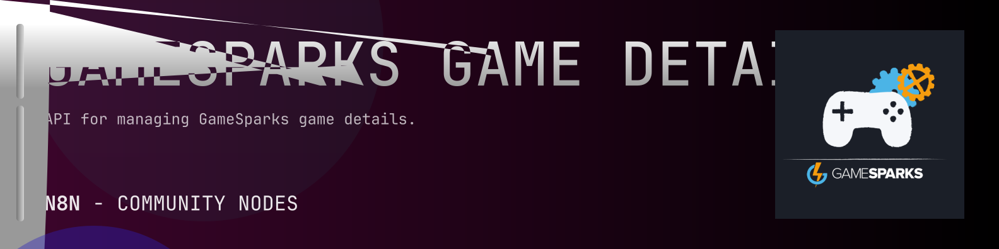

# @n8n-dev/n8n-nodes-gamesparks-game-details



[](https://www.npmjs.com/package/@n8n-dev/n8n-nodes-gamesparks-game-details)
[](https://opensource.org/licenses/MIT)

---

**Stop writing gamesparks-game-details API integrations by hand.**

Every time you connect n8n to gamesparks-game-details, you waste hours mapping endpoints, defining parameters, and debugging schemas. You copy-paste from docs, fix edge cases, and pray nothing breaks.

**What if connecting n8n to gamesparks-game-details took 5 minutes, not half a day?**

This node gives you **13+ resources** out of the box: **Scripts**, **Experiments**, **Billing Details**, **Manage**, **Analytics**, and 8 more: with full CRUD operations, typed parameters, and zero manual configuration.

---

## What You Get

- **Zero boilerplate**: Resources, operations, and fields are pre-configured and ready to use
- **Full CRUD**: Create, read, update, and delete support where the API allows it
- **Typed parameters**: No more guessing field types
- **Built-in auth**: API key authentication, ready to go
- **Declarative**: Native n8n performance, no custom execute() overhead

---

## Install

```bash
npm install @n8n-dev/n8n-nodes-gamesparks-game-details
```

**Or in n8n:**
1. **Settings → Community Nodes → Install**
2. Search: `@n8n-dev/n8n-nodes-gamesparks-game-details`
3. Click **Install**

---

## Quick Start

1. Install the node (above)
2. Add credentials: **gamesparks-game-details API** → paste your API key
3. Drag the **gamesparks-game-details** node into your workflow
4. Pick a resource → pick an operation → done.

That's it. No configuration files. No code. It just works.

---

## Resources

<details>
<summary><b>Scripts</b> (6 operations)</summary>

- Get ScriptDifferences
- Get exportZip
- Post importAccept
- Post importZip
- Get ScriptVersions
- Get ScriptVersions

</details>

<details>
<summary><b>Experiments</b> (6 operations)</summary>

- Get Experiments
- Post createExperiment
- Delete Experiment
- Get Experiment
- Put updateExperiment
- Post doActionExperiment

</details>

<details>
<summary><b>Billing Details</b> (2 operations)</summary>

- Get Retrieves the Billing Details
- Put Updates the Billing Details

</details>

<details>
<summary><b>Manage</b> (22 operations)</summary>

- Get listQueries
- Post createQuery
- Delete Query
- Get Query
- Put updateQuery
- Get listScreens
- Post createScreen
- Get listExecutableScreens
- Delete Screen
- Get Screen
- Put updateScreen
- Get listSnapshots
- Post createSnapshot
- Delete Snapshot
- Post copySnapshotToExistingGame
- Post publishSnapshot
- Post revertSnapshot
- Get listSnippets
- Post createSnippet
- Delete Snippet
- Get Snippet
- Put updateSnippet

</details>

<details>
<summary><b>Analytics</b> (3 operations)</summary>

- Get Returns the results of executed query defined by the parameters passed in
- Get Returns the count of executed query
- Get Returns the percentage of user retention over the last 30 days

</details>

<details>
<summary><b>Push Notification Test</b> (8 operations)</summary>

- Post testPushAmazonNotifications
- Post testPushAppleDevNotifications
- Post testPushAppleProdNotifications
- Post testPushGoogleNotifications
- Post testWindows8Notifications
- Post testWindowsPhone8Notifications
- Post testViberIntegrationNotifications
- Post testViberProductionNotifications

</details>

<details>
<summary><b>Credentials</b> (1 operations)</summary>

- Post Resets the secret of a credential

</details>

<details>
<summary><b>Snapshots</b> (11 operations)</summary>

- Get Snapshots
- Post createSnapshots
- Get LiveSnapshotId
- Get Snapshots
- Post revertToSnapshot
- Delete Snapshot
- Get Snapshot
- Post copySnapshotToNewGame
- Post copySnapshotToExistingGame
- Post publishSnapshot
- Post unpublishSnapshot

</details>

<details>
<summary><b>Games Admin</b> (4 operations)</summary>

- Get GamesEndpoints
- Post restoreDeletedGame
- Get list
- Get listDeleted

</details>

<details>
<summary><b>Region</b> (3 operations)</summary>

- Get RegionOptions
- Post setGameRegion
- Get GameRegionOptions

</details>

<details>
<summary><b>Test Harness</b> (5 operations)</summary>

- Get TestHarnessScenarios
- Post createTestHarnessScenario
- Delete TestHarnessScenario
- Get TestHarnessScenario
- Put updateTestHarnessScenario

</details>

<details>
<summary><b>Segment Query Filters</b> (4 operations)</summary>

- Get SegmentQueryFilters
- Get SegmentQueryFiltersConfig
- Put updateSegmentQueryFiltersConfig
- Get SegmentQueryStandardFilters

</details>

<details>
<summary><b>Notifications</b> (1 operations)</summary>

- Get GameSummary

</details>

---

## Why This Node?

**Without this node:**
- Hours of manual API integration
- Copy-pasting from gamesparks-game-details docs
- Debugging auth, pagination, error handling
- Maintaining your own client code

**With this node:**
- Install → configure → use. 5 minutes.
- Auto-generated from the official gamesparks-game-details OpenAPI spec
- Always up to date when the API changes
- Native n8n performance

---

## Auto-Generated
This node was auto-generated from the official **gamesparks-game-details** OpenAPI specification using
[@n8n-dev/n8n-openapi-node-ultimate](https://github.com/kelvinzer0/n8n-openapi-node-ultimate),
then validated against the live API so you get accurate types and real parameters, not guesswork.

When the gamesparks-game-details API updates, this node updates too.

---


## License

MIT © [kelvinzer0](https://github.com/n8n-code)
